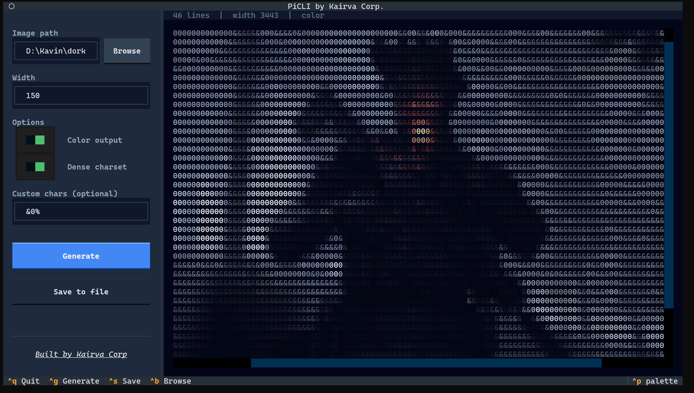
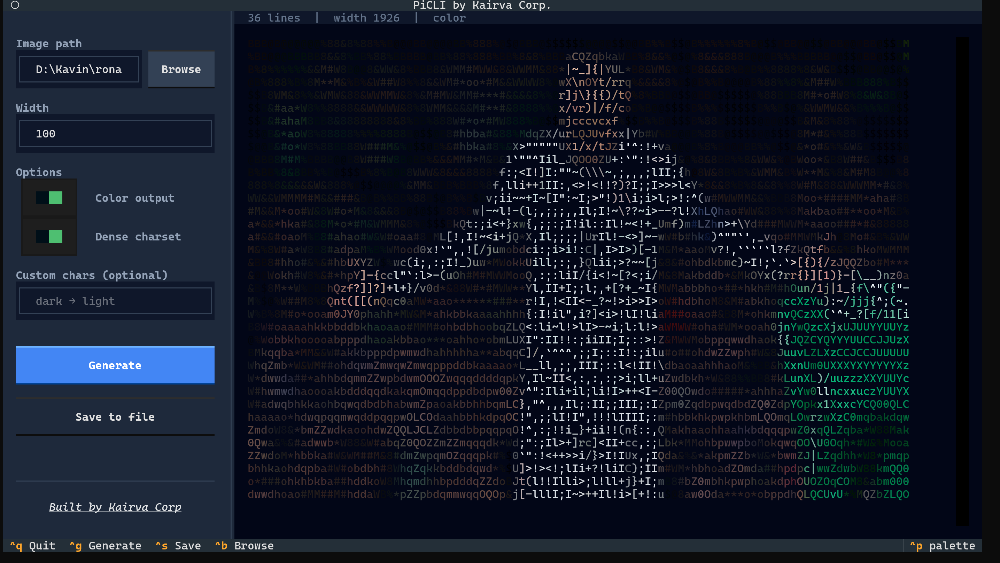
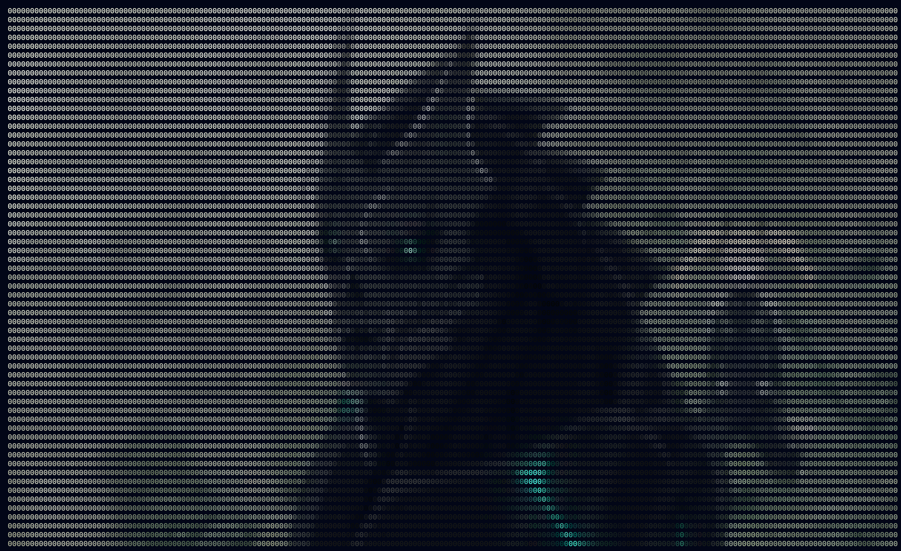
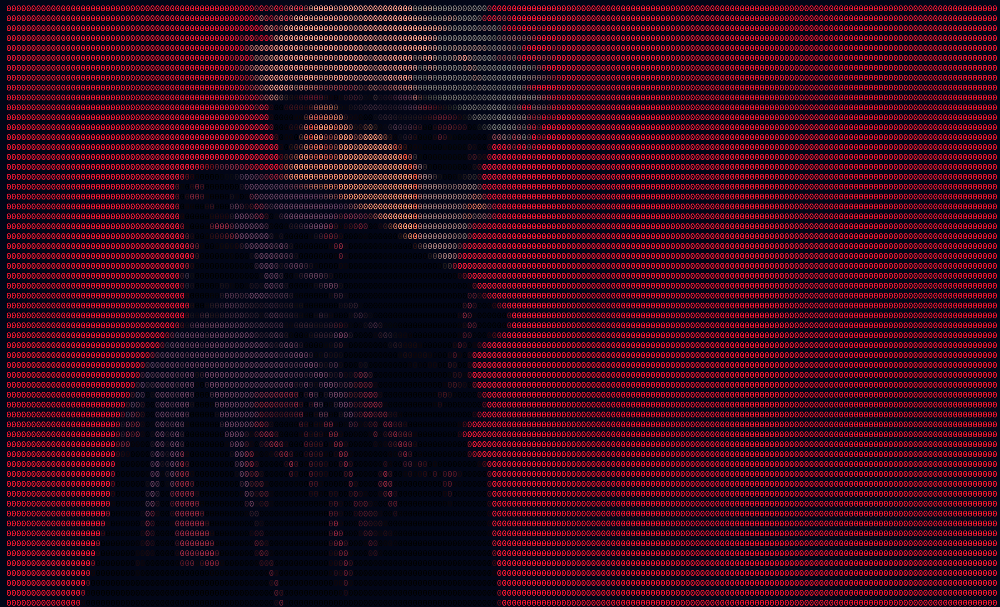
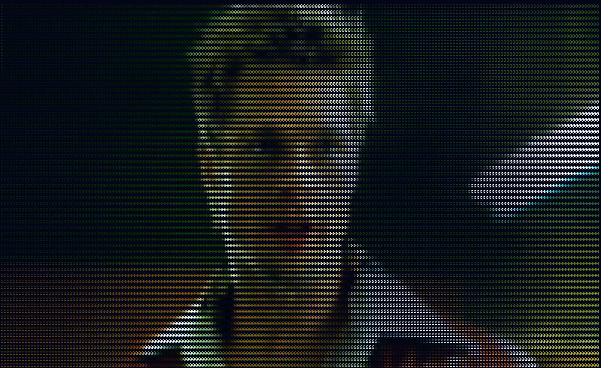
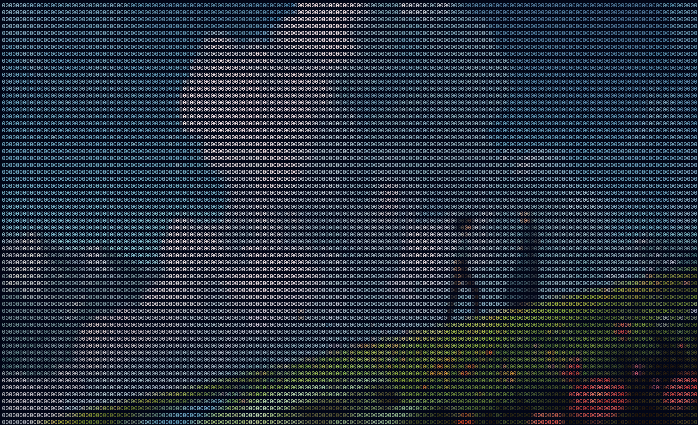

# PiCLI — ASCII Art Generator

PiCLI is a modern, high-performance terminal tool for converting images into stunning ASCII art. Built with **Textual**, it features a sleek, dark-themed interface and supports full-color conversions.

<div align="center">
  
  
</div>

## 🚀 Features

- **Standard & Dense Charsets**: Choose from multiple ASCII character sets or provide your own.
- **TrueColor Support**: Generate vibrant, color-accurate ASCII previews directly in your terminal.
- **Adjustable Resolution**: Control the output width to fit any terminal size.
- **Save to File**: Export your ASCII creations as clean text files (ANSI codes stripped for compatibility).
- **Interactive File Browser**: Easily navigate your filesystem to select images.
- **Terminal Auto-Scaling**: Optionally resize your terminal window automatically to perfectly fit the generated art width.

## 🛠️ Installation

Ensure you have Python 3.8+ installed, then install the dependencies:

```bash
pip install -r requirements.txt
```

## 🖥️ Usage

Simply run the script to launch the interactive UI:

```bash
python picli.py
```

### Keyboard Shortcuts
- `Ctrl + G`: Generate ASCII
- `Ctrl + S`: Save output to file
- `Ctrl + B`: Browse for image
- `Ctrl + Q`: Quit application

> [!TIP]
> **Resolution & Viewing**: Increasing the **Width** setting produces a more detailed design with higher accuracy. If you use a high width, you can use the **Auto-resize window** toggle or **zoom out / scale down** your terminal text size to view the full image at once.

---

## More Examples

| | |
| :---: | :---: |
|  |  |
|  |  |


**Built by [Kairva Corp](https://github.com/Kairva-Corp)** | *Bringing the world to your terminal*
